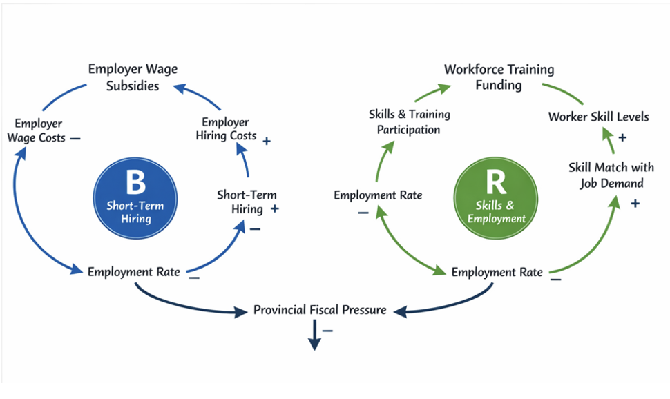

# Reducing Unemployment in Ontario
Evaluating Workforce Training versus Employer Wage Subsidies

## Decision Statement 

Should the Ontario Deputy Minister of Labour, Immigration, Training and Skills Development prioritize funding for targeted workforce training programs or employer wage subsidies to reduce Ontario’s provincial unemployment rate over the next 12–24 months?

## Executive Summary

Ontario's unemployment rate of 7.9% significantly exceeds the national average of 6.8%, reducing tax revenues and straining social programs. The Deputy Minister of Labour, Immigration, Training and Skills Development must choose between employer wage subsidies and workforce training programs to address this challenge.

Wage subsidies enable rapid hiring by reducing business costs but risk subsidizing existing jobs and providing only temporary relief. Training programs address structural unemployment by aligning skills with market demands, though benefits emerge more slowly and require precise targeting across Ontario's diverse economy.

Key stakeholders include unemployed workers, employers facing labour shortages, training providers, and provincial taxpayers. Despite existing initiatives like Employment Ontario and the Skills Development Fund, persistently high unemployment indicates current approaches need recalibration to effectively balance immediate relief with long-term economic resilience.

## Casual Loop Diagram 

## Explanation of CLD
In contrast to a balancing loop where wage subsidies temporarily lower unemployment by lowering employer recruiting costs, the draft CLD stresses a reinforcing loop that links workforce training, skill matching, and sustained employment. A fiscal constraint loop highlights the significance of strategic prioritization by demonstrating how high unemployment might restrict the government's ability to finance either measure.
