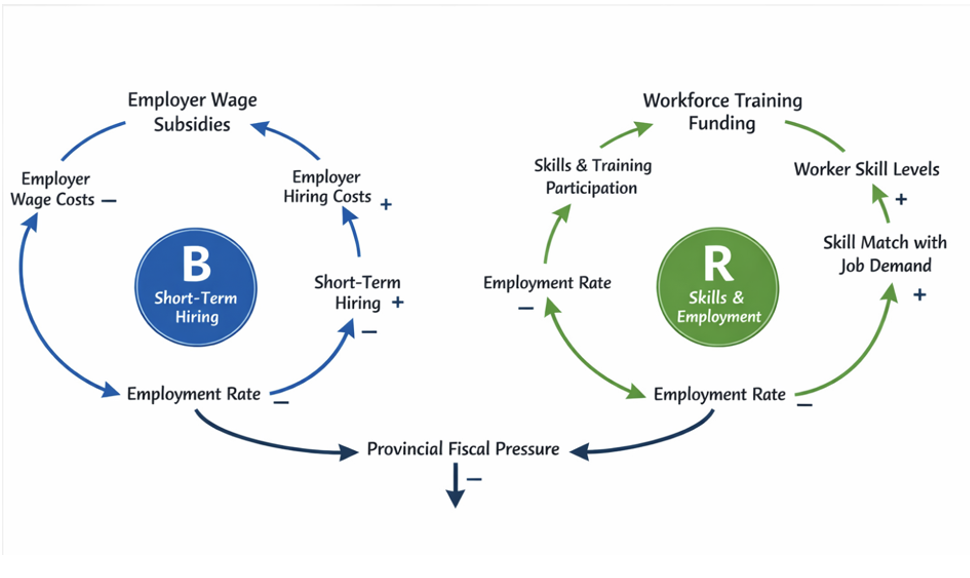

# Reducing Unemployment in Ontario
Evaluating Workforce Training versus Employer Wage Subsidies

## Decision Statement 

Should the Ontario Deputy Minister of Labour, Immigration, Training and Skills Development prioritize funding for targeted workforce training programs or employer wage subsidies to reduce Ontario’s provincial unemployment rate over the next 12–24 months?

## Executive Summary

Ontario's unemployment rate of 7.9% significantly exceeds the national average of 6.8%, reducing tax revenues and straining social programs. The Deputy Minister of Labour, Immigration, Training and Skills Development must choose between employer wage subsidies and workforce training programs to address this challenge.

Wage subsidies enable rapid hiring by reducing business costs but risk subsidizing existing jobs and providing only temporary relief. Training programs address structural unemployment by aligning skills with market demands, though benefits emerge more slowly and require precise targeting across Ontario's diverse economy.

Key stakeholders include unemployed workers, employers facing labour shortages, training providers, and provincial taxpayers. Despite existing initiatives like Employment Ontario and the Skills Development Fund, persistently high unemployment indicates current approaches need recalibration to effectively balance immediate relief with long-term economic resilience.

[Read More](background.md)

## Casual Loop Diagram 

## Explanation of CLD
In contrast to a balancing loop where wage subsidies temporarily lower unemployment by lowering employer recruiting costs, the draft CLD stresses a reinforcing loop that links workforce training, skill matching, and sustained employment. A fiscal constraint loop highlights the significance of strategic prioritization by demonstrating how high unemployment might restrict the government's ability to finance either measure.

## System Archetype Identification
The Shifting the Burden archetype is evident in Ontario’s unemployment policy context, where decision-makers must balance short-term reductions in unemployment with long-term labour market improvements. In this system, reducing hiring expenses and promoting quicker job creation, employer wage subsidies provide a short-term "quick fix," creating a balanced loop that temporarily lowers unemployment. Although, this approach does not address the underlying issue of gap between job and skill, particularly within Ontario’s diverse and segmented labour market. The fundamental solution lies in targeted workforce training programs, such as the Skills Development Fund and Better Jobs Ontario. These can aim to improve worker skills and better align them with labour market demand. The programs create a reinforcing loop, where increased skills lead to better job matching, sustained employment, and long-term reductions in unemployment. However, depending too heavily on wage subsidies may eventually result in less money being invested in training programs. This might lead to a continuous cycle of skill shortages and high unemployment. Ultimately, the following system displays how short-term symptom relief undermines long-term capacity, reinforcing the Shifting the Burden archetype and limiting the effectiveness of policy interventions.

## Scenario Narratives 
Scenario 1: Status Quo 
If Ontario continues with its current balance of wage subsidies and workforce training programs, unemployment is likely to remain moderately increased over the next 5–10 years. Wage subsidies will continue to reduce hiring costs and support short-term employment, particularly in sectors experiencing labour shortages. Although, these effects are temporary and do not address the underlying issue of job-skill mismatch. Training programs such as the Skills Development Fund and Better Jobs Ontario will continue to improve outcomes for some individuals, but without stronger alignment to labour market demand, their overall impact will remain limited. As a result, the system stabilizes but does not significantly improve, with ongoing fiscal pressure from maintaining both strategies and continued vulnerability to external economic changes.

Scenario 2: Intervention A (Prioritize Wage Subsidies)
If the government prioritizes employer wage subsidies, unemployment may decrease more rapidly in the short term (1–3 years) as lower hiring costs incentivize employers to expand their workforce. This approach strengthens short-term employment gains and produces visible results quickly. Despite this, structural problems are anticipated to worsen over the course of 5-10 years as lower investment in worker training results in ongoing skill gaps, especially in industries with high demand. Employers may also become dependent on subsidies, creating instability if funding is reduced and resulting in inefficient use of public resources. Furthermore, this approach risks increasing inequality because individuals without  relevant skills remain excluded from stable employment opportunities, reinforcing long-term labour market imbalances.

Scenario 3: Intervention B (Prioritize Workforce Training)
If Ontario prioritizes targeted workforce training programs, reductions in unemployment may occur more slowly in the short term due to the time required for individuals to gain new skills and transition into employment. However, over a 5-10 year period, this strategy strengthens the feedback loop between job matching, skill development, and long-term employment. In turn, leading to more stable and long-term reductions in unemployment. By improving alignment between training programs and labour market demand, workers are better equipped for in-demand roles, and employers benefit from a more qualified labour pool. While this strategy carries risks such as delayed outcomes and potential misalignment if labour demands shift, it offers the most sustainable and effective solution by addressing the root causes of unemployment rather than relying on temporary fixes.

## Leverage Point Analysis
The most effective leverage point in Ontario’s unemployment system is improving the alignment between workforce training programs and actual labour market demand. This intervention directly targets the root cause identified in the system job-skill mismatch, instead of focusing on short-term symptoms such as high unemployment rates. By ensuring that training programs are closely connected to the needs of employers and high-demand sectors, the province can strengthen the reinforcing feedback loop in which increased skills lead to better job matching, sustained employment, and long-term reductions in unemployment. Additionally, this strategy minimizes rely on wage subsidies, which are essentially temporary fixes that may eventually lead to dependency. Implementing this leverage point would involve collaboration between government, employers, and training institutions. Furthermore, it also needs the use of real-time labour market data to guide program design. Rather, there are risks associated with this strategy, including the time required to see measurable results, the possibility of misalignment if labour market demands shift, and potential resistance from stakeholders who benefit from existing subsidy programs. Considering these barriers, focusing on training alignment provides a high-impact, long-lasting solution that enhances the long-term efficacy of public investment as well as the efficiency of the labour market.

## Connection to Decision-Maker’s Choice 
The analysis clearly informs the decision facing the Deputy Minister of Labour, Immigration, Training and Skills Development regarding whether to prioritize workforce training programs or employer wage subsidies. The system archetype of “Shifting the Burden” demonstrates that reliance on wage subsidies, while effective in reducing unemployment in the short term, risks reinforcing dependency and failing to address the underlying issue of job-skill mismatch. The scenario analysis further supports this by illustrating how prioritizing subsidies leads to temporary improvements but weaker long-term outcomes. Putting emphasis on worker training yet leads to slower initial gains but longer-lasting decreases in unemployment. In addition, the leverage point analysis highlights that aligning training programs with labour market demand offers the greatest long-term impact by strengthening the reinforcing loop between skills and employment. Therefore, the most effective course of action is for the Deputy Minister to prioritize targeted workforce training programs, while using wage subsidies selectively as a complementary tool rather than a primary strategy. The above plan encourages long-term labour market stability and economic resilience in Ontario while avoiding the drawbacks of temporary solutions.

## Decision Recommendations 
It is recommended that the Deputy Minister of Labour, Immigration, Training and Skills Development prioritize targeted workforce training programs as the primary strategy to reduce Ontario’s unemployment rate, while using employer wage subsidies selectively as a complementary, short-term support tool. This approach addresses the root causes of unemployment. It looks closely at job-skill mismatch while still allowing flexibility to respond to immediate labour market needs.
This recommendation is supported by several key findings from the analysis. First, the system exhibits a pattern in which short-term solutions, such as wage subsidies, can reduce unemployment quickly but do not produce lasting improvements. While subsidies lower hiring costs and increase employment in the short term, they do not improve worker skills or address mismatches between available jobs and workforce capabilities. Second, workforce training programs create more sustainable outcomes by improving skill levels and strengthening alignment with labour market demand. Over time, this leads to better job matching, increased productivity, and more stable employment. The causal loop analysis further demonstrates that prioritizing training strengthens long-term positive feedback loops, while over-reliance on subsidies risks creating dependency and weakening long-term system performance. Additionally, existing provincial programs such as the Skills Development Fund and Better Jobs Ontario provide a strong foundation that can be expanded and better targeted.
However, this recommendation is not without uncertainty. Workforce training programs require time to produce measurable results, and their effectiveness depends heavily on how well they align with current and future labour market demand. If training programs are poorly designed or fail to adapt to changing economic conditions, their impact may be limited. In situations where rapid economic downturns occur or immediate job creation is required, wage subsidies may need to play a larger role in stabilizing employment in the short term. Therefore, a flexible approach that adjusts based on economic conditions is important.
To implement this recommendation, several next steps are advised. First, strengthen partnerships between government, employers, and training institutions to ensure training programs are directly aligned with in-demand skills. Second, use real-time labour market data to guide funding decisions and continuously update program offerings. Third, prioritize investment in high-growth sectors such as healthcare, skilled trades, and technology, where labour shortages are most significant. Finally, establish clear performance metrics to evaluate program outcomes and ensure accountability for public spending.
Further analysis could be strengthened by more detailed, sector-specific data on employment trends, skill shortages, and program outcomes across Ontario. Additionally, longitudinal data tracking participants in training programs would provide valuable insight into long-term employment impacts. Collecting this information would allow for more precise targeting of interventions and improve overall policy effectiveness.
In conclusion, prioritizing workforce training but still maintaining targeted use of wage subsidies gives the opportunity for the most effective and sustainable strategy for reducing unemployment and supporting long-term economic resilience in Ontario.

## Reflection 
This project strengthened my ability to think beyond surface-level problems and understand how complex systems influence real-world decisions. One of the most surprising insights was how short-term solutions, such as wage subsidies, can unintentionally weaken long-term outcomes if they are overused. Initially, I assumed that reducing unemployment quickly would always be the most effective approach, but this project highlighted the importance of addressing root causes, such as job-skill mismatch, to achieve sustainable results. I also developed skills in systems thinking, data interpretation, and policy analysis. Creating the causal loop diagram helped me visualize how different variables interact and reinforced the importance of feedback loops in shaping outcomes. Additionally, translating technical concepts into clear, accessible language improved my ability to communicate complex ideas to non-technical audiences. This can be an essential skill in both business and policy environments. If I were to approach this project again, I would incorporate more detailed quantitative data to strengthen scenario projections and support recommendations further. Overall, this project enhanced my ability to connect data, theory, and decision-making in a practical and meaningful way.
